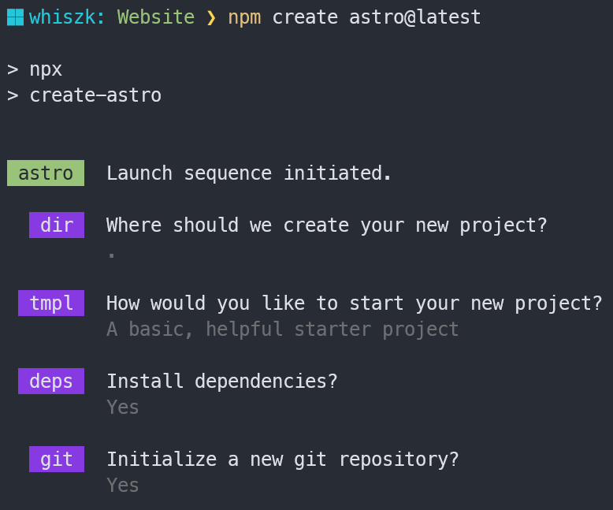
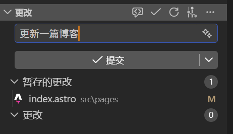

## 初始
### 暂定需求

静态展示部分：
- 社团发展历程
- 优秀成员风采
- 社团优秀项目展示
- 友情链接

**动态资讯**部分：
- 新闻推文
- **社团系列博客**
- 赛事通知
- 实时活动通知

互动功能部分：
- 开发板、书籍借助平台
- 实验室参观预约

社团成员独享：
- 内部资料（github链接，文章等形式）

---

### 框架选型与依赖安装

使用 Astro 框架
- 适合内容展示型网站
- 对 md 和 json 的内容支持很好，方便创作

如果您也想开发一个 Astro 项目，可以简单参考下面的指令

```bash
npm create astro@latest
```

项目的初始化选项随意就好



会用到的命令基本就这两个

```bash
npm install #安装依赖
npm run dev #启动进程
```

### 从微信公众号链接快速发布新闻

如果你只有推文链接，可以直接用下面命令生成新闻文件：

```bash
npm run import:wechat -- "https://mp.weixin.qq.com/s/你的推文参数"
```

可选：指定更易读的目录 slug：

```bash
npm run import:wechat -- "https://mp.weixin.qq.com/s/你的推文参数" spring-meeting-2026
```

执行后会自动生成：

- `src/content/news/<slug>/index.md`
- 自动填充 `title/date/description/cover`
- 自动抓取正文（如果解析失败，会保留原文链接）

---

## 成员协作
### 说明

- 目前该网站 github 仓库属于个人，后续可考虑加入 github 的 organization
- 为了方便协作，我会直接邀请博客、推文、网站迭代的负责人作为仓库的 collaborator，然后直接 push 到 main 分支就行，vercel 会自动抓取

### 具体操作

协作者需要将项目 clone 到本地，有node环境就行，win和linux均可

```bash
git clone https://github.com/whiszk/Waymaker.git
cd Waymaker-main
```

此时打开可视化 git 工具，应该可以看到 git 历史

当你完成修改（推文撰写，网站外观更新等）后，首先需要将修改同步到本地

```bash
# 提交修改
git add .

git commit -m "更新一篇博客"
```

或者也可以采用可视化的操作方式，比如 vs code 的 git 页面



然后同步到云端

```bash
# 第一次推送，需要 -u 绑定默认远程分支
git push -u origin main

# 后续直接 git push 就行
git push
```