> 该文章主要介绍了openGauss数据库在云服务器上的部署以及使用方法，openGauss作为关系型数据库的一种，与Mysql，Postgresql等软件的使用方法基本一致，但考虑到后端+数据库+上云的工程实践，对于未接触过的同学来说，容易迷茫、碰壁，因此以博客的方式记录基本流程，以供参考。


[参考文章](https://blog.csdn.net/2201_76004325/article/details/134445769)
[官方教程](https://docs.opengauss.org/zh/docs/6.0.0/docs/InstallationGuide/%E5%8D%95%E8%8A%82%E7%82%B9%E5%AE%89%E8%A3%85.html)


## 一 前期准备
### 1.1 云服务器购买

笔者购买的是[华为云的弹性云服务器](https://www.huaweicloud.com/product/ecs.html)
各个厂商的服务差不多，购买并配置后，你应该得到并记住：

- 服务器的公网ip
- root用户的密码

以下是推荐配置（针对社团项目组）：
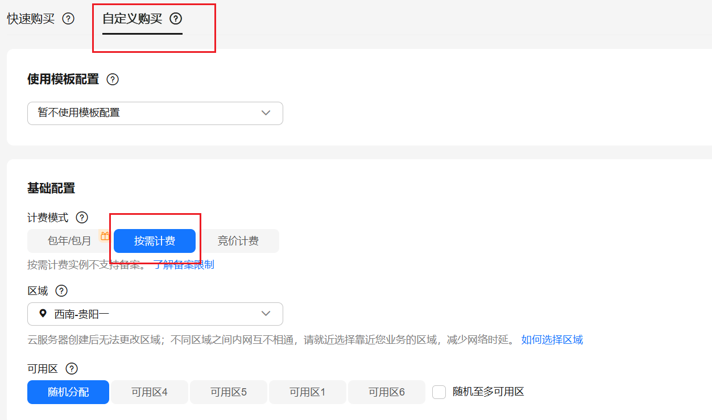

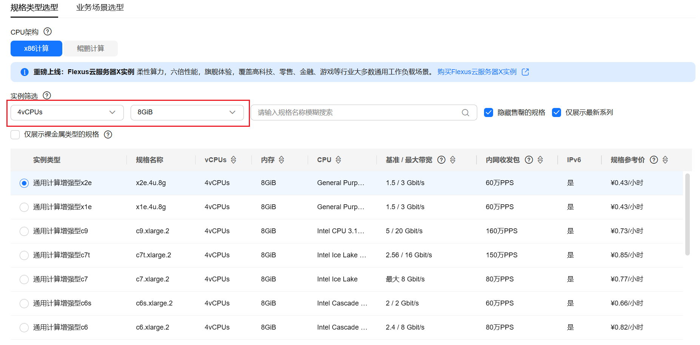
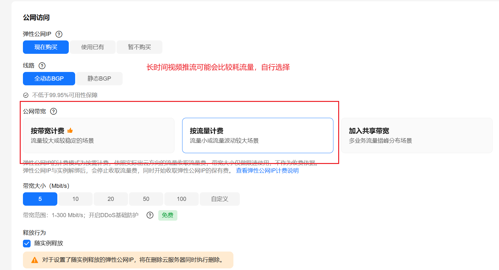


买完之后，记得安全组放行端口
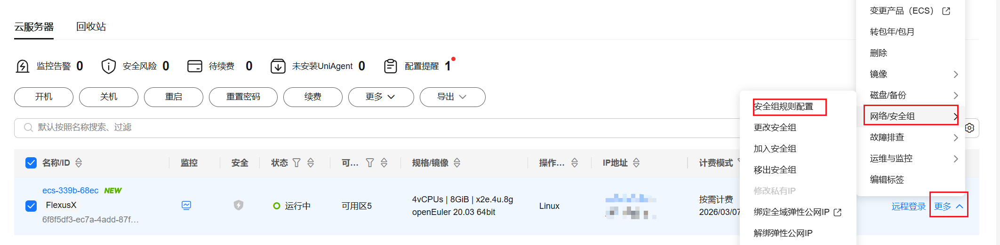


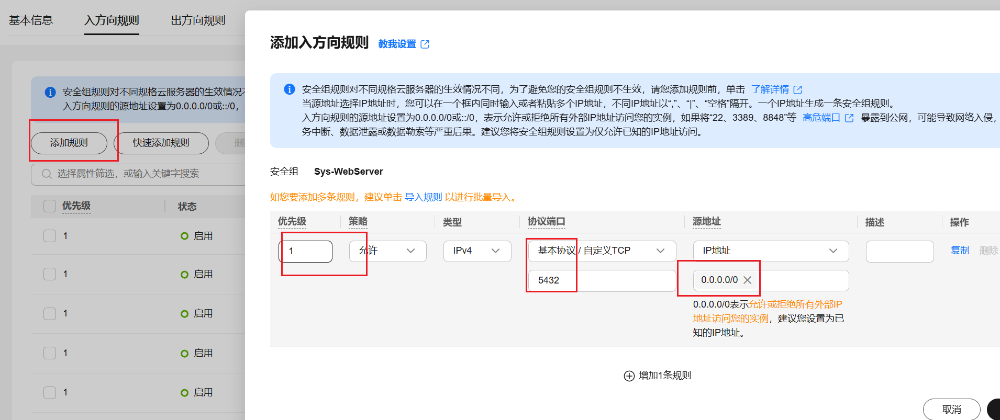


### 1.2 本地SSH客户端安装

相比于每次手动输出命令、密码，从本地终端中ssh到服务器而言，有一个专门的ssh客户端还是方便许多

这里推荐用[mobaxtern](https://mobaxterm.mobatek.net/download-home-edition.html)


### 1.3 本地SQL客户端安装

[官网](https://dbeaver.io/download/)
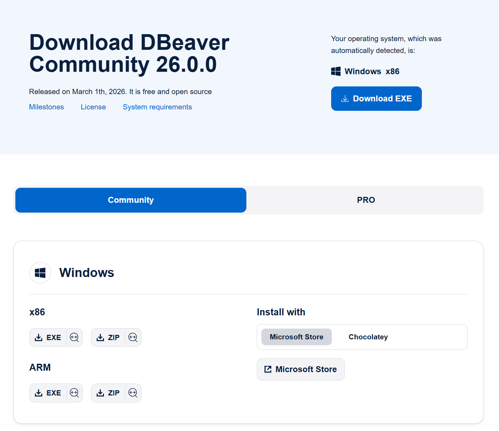


- 下载社区版本
- 嫌麻烦的话，可以直接用微软商店下载


---
## 二 openGauss安装
### 2.1 ssh进入服务器

进入云服务器的管理界面，查看公网ip，复制
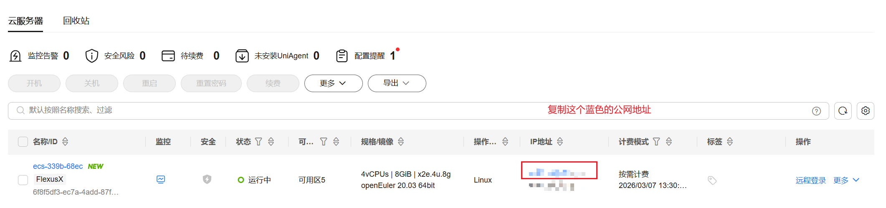


然后打开mobax，点击session，输入ip，username填root，点击ok后，输入刚才自己设置的密码

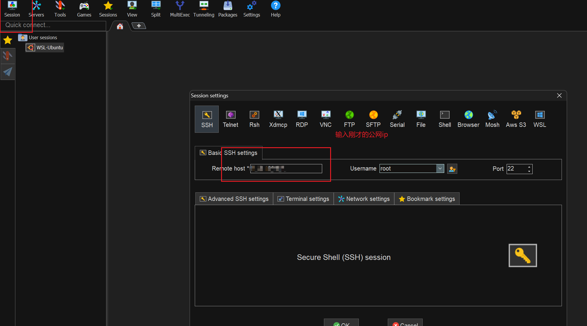

成功进入

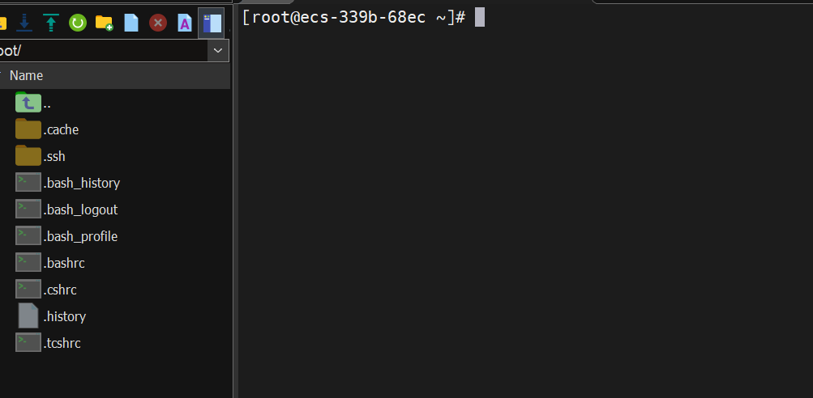

### 2.2 创建操作系统新用户
我们应该避免在root用户下进行开发，所以首先为当前操作系统创建新用户
依次执行以下命令：
- 将 username 替换为你想要设置的实际用户名

```bash
sudo useradd username
```

- 设置密码
```bash
sudo passwd username
```

- 赋予管理员权限

```bash
sudo usermod -aG wheel username
```


最后验证一下，运行id username，看看状态
```
[root@ecs-339b-68ec ~]# id whiszk
uid=1000(whiszk) gid=1000(whiszk) groups=1000(whiszk),10(wheel)
```
并确认你的home下面有相应的用户文件夹
```
[root@ecs-339b-68ec home]# pwd
/home
[root@ecs-339b-68ec home]# ls
whiszk
```
### 2.3 安装opengauss
- 关闭防火墙,确保active状态是dead
```bash
systemctl stop firewalld.service
```
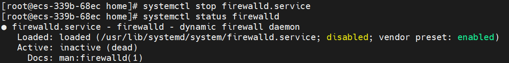

然后安装一个依赖
```
sudo yum install -y libaio
```

- 现在切换到我们刚才创建的用户
```bash
su username
```
- 确保当前终端路径为/home/username
```
[whiszk@ecs-339b-68ec ~]$ pwd
/home/whiszk
```

- 然后下载软件包，我这里下的是6.0.0的极简版，openEuler20.03，注意和自己的实际情况对应，官网没给出网页链接的下载方式，如果要安装其他版本，可以尝试替换，不行的话就问高级一点的ai
```
wget https://opengauss.obs.cn-south-1.myhuaweicloud.com/6.0.0/openEuler20.03/x86/openGauss-Server-6.0.0-openEuler20.03-x86_64.tar.bz2
```
- 解压，这里直接解压在用户文件夹了，省事
```
[whiszk@ecs-339b-68ec ~]$ mkdir openGauss && tar -jxf openGauss-Server-6.0.0-openEuler20.03-x86_64.tar.bz2 -C ~/openGauss
```
- 然后进入这个文件夹的simpleinstall子文件夹
```bash
[whiszk@ecs-339b-68ec ~]$ ls
openGauss  openGauss-Server-6.0.0-openEuler20.03-x86_64.tar.bz2
[whiszk@ecs-339b-68ec ~]$ cd openGauss
[whiszk@ecs-339b-68ec openGauss]$ ls
bin  etc  include  jre  lib  share  simpleInstall  version.cfg
[whiszk@ecs-339b-68ec openGauss]$ cd simpleInstall/
[whiszk@ecs-339b-68ec simpleInstall]$ ls
finance.sql  install.sh  README.md  school.sql
```

- 运行安装脚本，一路yes就行
```
sh install.sh  -w "xxxx" -p 5432 &&source ~/.bashrc

# 其中
-w：初始化数据库密码，因安全需要，此项必须设置，位数至少8位，三种字符
-p：指定openGauss端口号，如不指定，默认为5432
```
- 虽然看上去很多报黄，但不影响安装成功，确保你输入这个命令后，能正常显示进程就行
```bash
[whiszk@ecs-339b-68ec simpleInstall]$ ps ux | grep gaussdb
whiszk     29762  0.8 12.1 6171420 897872 ?      Ssl  14:30   0:01 /home/whiszk/openGauss/bin/gaussdb -D /home/whiszk/openGauss/data/single_node
whiszk     30821  0.0  0.0 212808   796 pts/0    S+   14:33   0:00 grep --color=auto gaussdb

```
- 在这一章节的最后，输入这个命令来确认安装是否完成，如果有问题，请问大模型
```bash
[whiszk@ecs-339b-68ec simpleInstall]$ gsql -d postgres -p 5432
gsql ((openGauss 6.0.0 build aee4abd5) compiled at 2024-09-29 18:39:52 commit 0 last mr  )
Non-SSL connection (SSL connection is recommended when requiring high-security)
Type "help" for help.

openGauss=# 
```
> 做个总结，我们现在完成了openGauss的安装，如果你完全按照笔者的配置与做法来做，不会出现大的问题，官方教程建议单开一个用户管理数据库，但我们的项目并非生产级别，因此我选择直接放在当前用户的目录下，如果你想做得更规范，参考我在文章开头贴出的
### 2.4 基本命令
梳理一下当前阶段以及下一阶段可能会用到的命令，注意路径要因地制宜
```bash
# 服务器关机重启之后，要手动启动opengauss
gs_ctl start -D /home/whiszk/openGauss/data/single_node/ 

# 重启
gs_ctl restart -D /home/whiszk/openGauss/data/single_node/

# 默认的超级管理员进入数据库
gsql -d postgres -p 5432

# 指定用户进入数据库
gsql -d postgres -p 5432 -U remoter
```

## 三 远程连接配置
我们很少会对着数据库的终端跑命令，通常都是用本地的SQL客户端进行可视化操作，这里就涉及到远程连接，以下是步骤
### 3.1 修改openGauss配置文件
如果你使用的是mobax，直接在左侧browser输入这个路径，双击打开postgresql.conf文件，或者在终端用vim打开
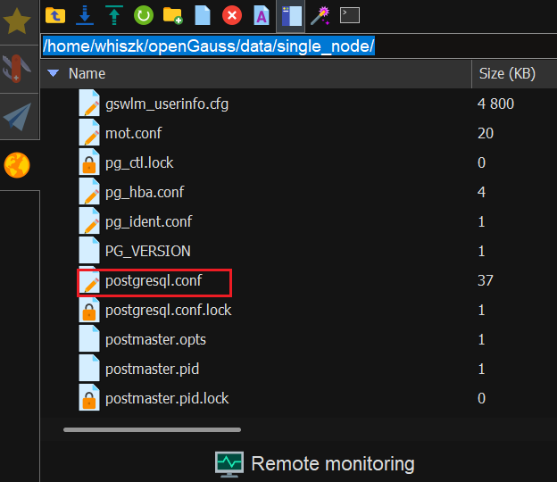


然后编辑加密方式为0（默认为2），记得删掉#注释符，用 vim 的话，可以输入 /password，再回车，就能实现搜索
```txt
password_encryption_type = 0            
#Password storage type, 0 is md5 for PG, 1 is sha256 + md5, 2 is sha256 only
```

开放监听，找到同文件中的 `#listen_addresses` = 'localhost' ，修改为 `listen_addresses = '*'`。注意前面的#注释也要去掉，这里的修改是允许远程访问的关键
```txt
listen_addresses = '*'
```
验证结果如下，要看到0.0.0.0:5432

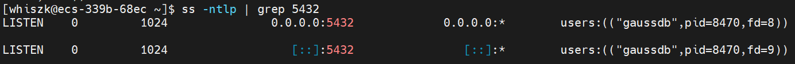


Postgresql

接着修改 同文件夹下的**pg_hba.conf** (白名单与认证方式)
打开 `/home/whiszk/openGauss/data/single_node/pg_hba.conf`，保留本地 trust 不变，在最后追加一行：
host  all  all  0.0.0.0/0  md5。

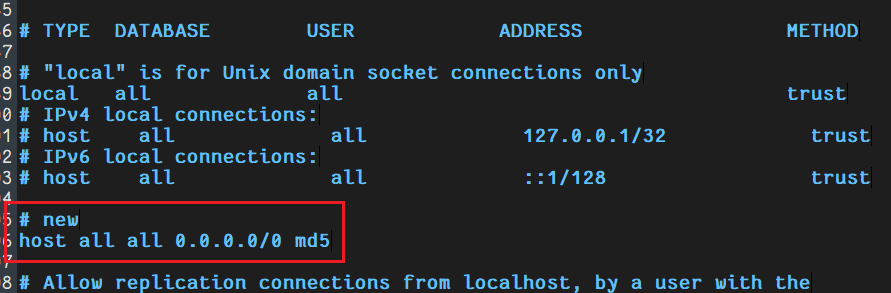


### 3.2 创建openGauss的新用户

首先回到服务器的终端，因为openGauss **不允许初始用户远程连接**（因为他作为超级管理员，权限太高了），所以需要在服务器端，新创建一个数据库的用户，注意是**数据库用户**而不是操作系统用户，同时记得赋予权限，然后DBeaver使用该用户远程连接就行
我们之前运行
```bash
[whiszk@ecs-339b-68ec simpleInstall]$ gsql -d postgres -p 5432
```
是没有指定用户的，此时openGauss会以你运行安装脚本的用户，作为数据库的超级管理员，进入，我们来辨别概念：
- 操作系统有用户，我们刚才把openGauss安装在了这个用户的文件夹下，并以这个用户的身份，运行安装脚本
- openGauss作为一个软件，也有用户的概念，目前为止，它只有一个超级管理员用户

所以我们要做的就是再创建一个数据库的普通用户，
首先使用初始用户身份登录 gsql：

```bash
gsql -d postgres -p 5432
```


在 openGauss=# 提示符下，使用 CREATE USER 命令创建新用户。注意：openGauss 默认的密码策略非常严格。密码必须至少包含 8 个字符，并且必须包含大写字母、小写字母、数字和特殊字符中的至少三种。

假设我们要创建一个名为 remoter 的用户，密码为 Project@2026：

```sql
CREATE USER remoter WITH PASSWORD 'Project@2026';
```
如果创建成功，系统会返回 CREATE ROLE。

为新用户赋予权限，为了避免后续建表、建库时频繁遇到权限不足的报错，最省事的方法是直接将这个用户提升为系统管理员

```sql
ALTER USER remoter SYSADMIN;
```
做完这些之后，在终端输入
```bash
openGauss=# \q
```
退出数据库，然后输入gsql -d postgres -p 5432 -U remoter，根据自己取的名字调整，输入刚才设定的密码，就可以进入数据库，注意终端的提示符号发生了变化
```bash
[whiszk@ecs-339b-68ec ~]$ gsql -d postgres -p 5432 -U remoter
Password for user remoter:
gsql ((openGauss 6.0.0 build aee4abd5) compiled at 2024-09-29 18:39:52 commit 0 last mr  )
Non-SSL connection (SSL connection is recommended when requiring high-security)
Type "help" for help.

openGauss=>

```
### 3.3 Dbeaver 配置与连接
接下来正式开始连接，从 [openGauss 官网](https://opengauss.org/zh/download/?version=lts)下载 **JDBC** 驱动，然后参照官方详细的[指导文档](https://opengauss.org/zh/blogs/justbk/2020-10-30_dbeaver_for_openGauss.html)配置 DBeaver 的驱动文件，
- 注意下驱动的时候看清楚架构和操作系统，如果不知道服务器是什么架构。运行
```
[whiszk@ecs-339b-68ec ~]$ uname -m
x86_64
```


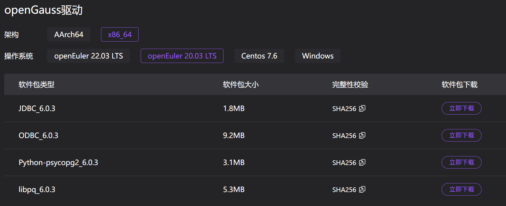


一路跟着官方文档做，除了dbeaver的前端页面较旧版有变化，其他应该没啥问题，哦对了，下载下来的驱动需要解压两次，如果你的解压软件不行，尝试换一个

配完驱动，开始连接，做到这一步时，就大功告成了

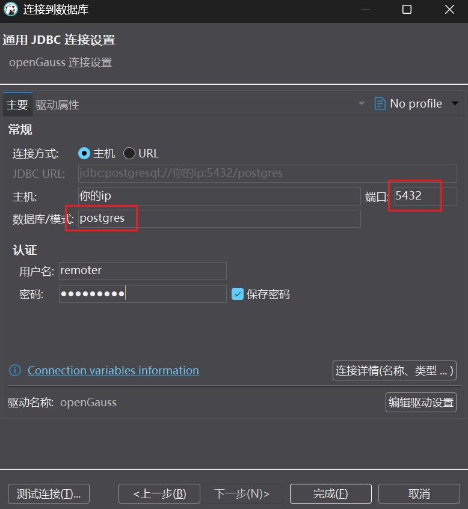


常见问题：
1. 显示无法访问：确保配置文件修改了，然后看防火墙，再看你的云厂商的安全组有没有放行
2. 显示密码错误：看看是不是之前没有改配置文件的时候没有删注释，然后再重启数据库
