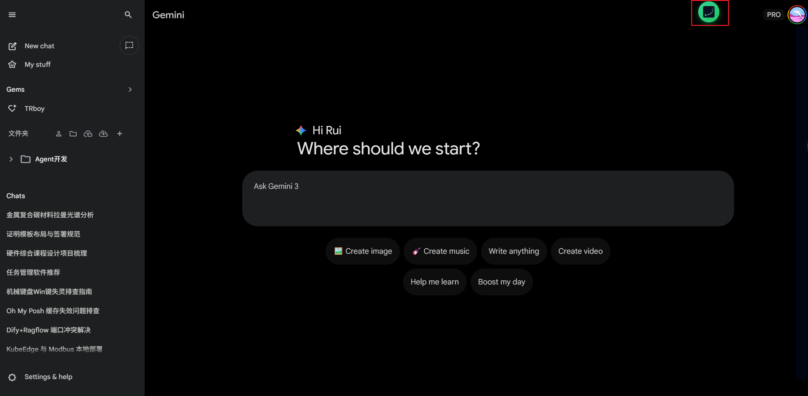
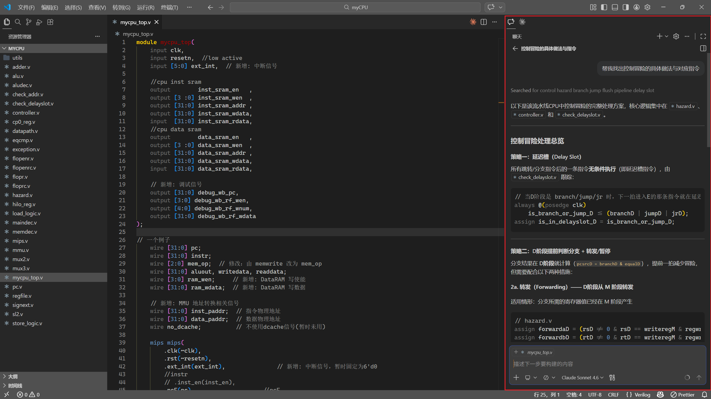
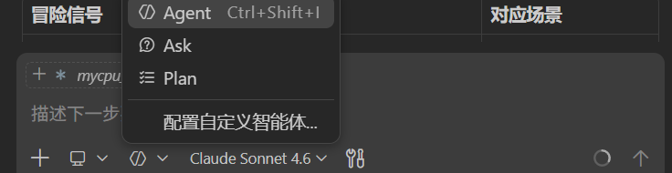
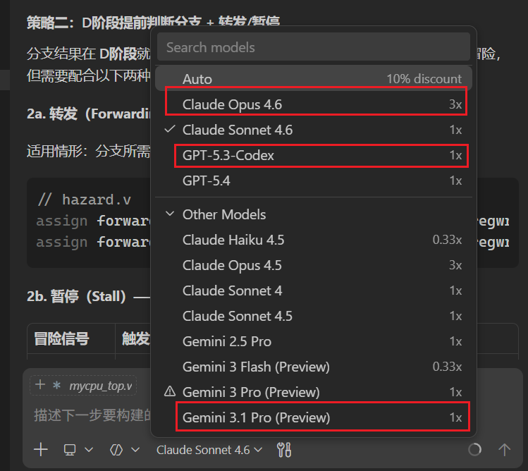
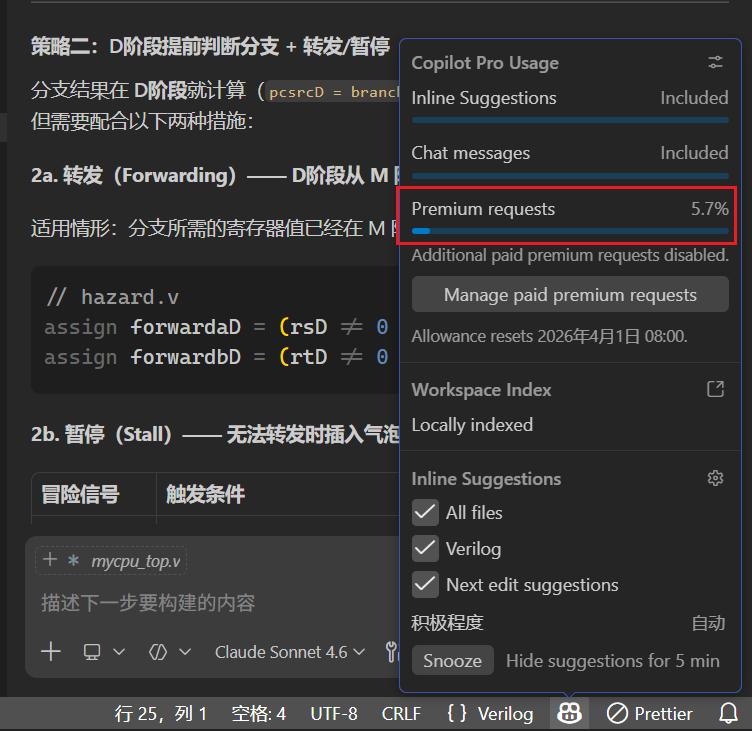
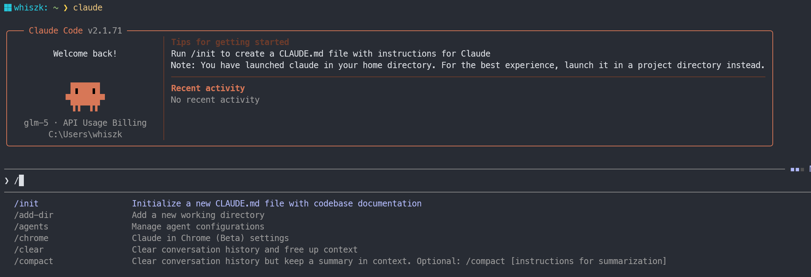
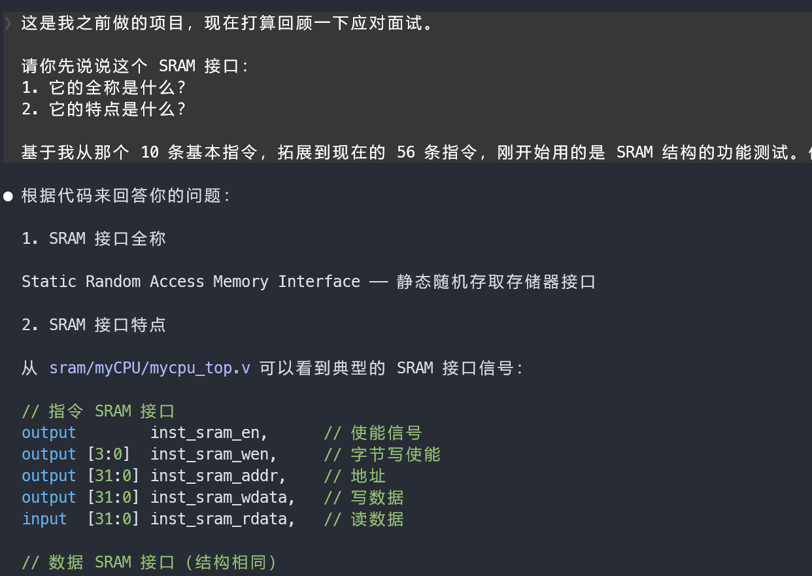
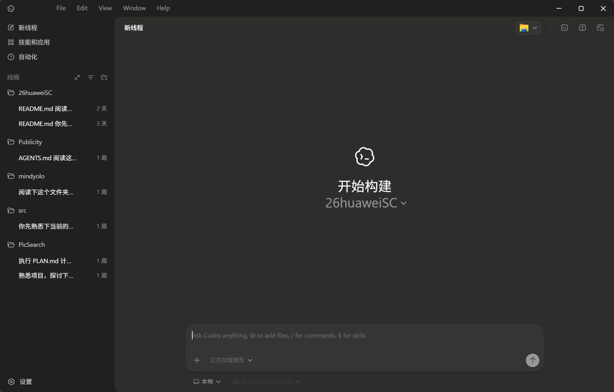

## web端chat
### Gemini

*优点*
- 现在有学生认证优惠，免费送一年gemini，国内认证的话，最简单的方法，闲鱼等平台提供十几块钱的一条龙服务，活动截止时间**2026.4.30**
- 使用体验非常好

*缺点*
- 对梯子质量要求高
- 如果是**新注册**的 google 账号订阅 gemini ，ip节点变动很容易被封

*总结*：如果有长期自用的谷歌账号+靠谱的梯子，可从闲鱼上找商家免费帮忙认证（搜索关键词：gemini学生认证），搭配浏览器的 **Gemini Voyager** 插件，使用体验非常好

---
## 本地 Agent 工具
### vScode copilot pro 插件

*优点*
- 微软的copilot长期有学生认证福利，认证成功后有**两年的免费使用期**，自己认证难度不大，可以参考网上的各种博文，比如[这个](https://blog.csdn.net/qq_46106285/article/details/149153111),也可以找闲鱼，几块钱搞定
- 拿到pro后，虽然每月有token额度上限，但高强度使用两周以内的时间，完全没问题
- 模型可供选择的种类多，且微软的更新很快，新模型一出，过几天就可以在copilot里调用
- 对梯子要求不高，能翻就行

*缺点*
- 官方审核比较慢，且拿到资格后需要等待72小时才能使用
- 只能在vscode编辑器内使用

插件的形态：

agent（通用：回答+编辑），plan（做计划），ask（问答）三种模式

各大厂商最新最强的模型可供调用

充足的额度

*总结*：花上一两个小时的折腾时间，就可以享受两年的畅快编码体验，物超所值，十分推荐

### claude code 命令行agent
*优点*
- agent 能力强（可以理解为，在调用相同大模型的情况下，claude code能较好地理解使用者的意图，最能完成使用者的目标）
- 形态上，不再局限于代码编辑器内部的插件，更为灵活，当然vscode也有它的插件，进行可视化的交互，不过claude code的产品最优形态还是命令行
- 不光能编码，做一些其他事务也很强，个人认为，最近很火的openclaw能做的事情，它早就都能做到，只不过openclaw的产品形态更符合大众预期

*缺点*
- 订阅claude的套餐或者购买他们的api，很贵，且不稳定，因为claude不面向中国大陆用户，解决方案是，使用这个agent本身，但是api用国内的第一梯队大模型（GLM-5，minimax2.5，kimi等），使用体验几乎没区别，具体操作方法可以参考[这个文章](https://zhuanlan.zhihu.com/p/1994894438053470382)，注意，虽然我们不用claude的那些模型，但第一次登陆时还是需要claude账号，这个推荐闲鱼买一个，后面就不用登陆了，也就是说不翻墙也能用

一些演示，需要从终端启动

*总结*：
- 没有学生优惠，订阅国内的大模型token套餐，虽然不贵（各厂商对新用户首月的收费很低），但也不算很便宜（正常情况下40块一个月，还不一定够用）
- 生态位上，其实和vscode copilot有所冲突，像我之前一直没用过claude code，也能完成任务，但是两者对比使用的话，还是有所互补之处，重点是，能更加贴切的体会到agent之间的差距，从而对自己想要的ai agent工具能力边界更清晰

### Codex
*优点*
- 订阅 gpt plus 以上的套餐，就能同时享受网页端的 chat 和 codex 应用，比较实惠
- 产品形态与传统的IDE式体验不同，尝试探索vibe coding的一种态势，适合多agent的协作模式

*缺点*
- 闲鱼上原本有大量 gpt business 在出售，每月仅需10元，但最近openai政策收紧，可能需要订阅个人版 plus 才能继续使用，价格在 30元左右
