# 秋季纳新及第一次全体大会 圆满结束

金秋送爽，万象更新。在这个充满希望的季节，重庆大学学生智能基座协会

## 活动内容

金秋送爽，万象更新。在这个充满希望的季节，重庆大学学生智能基座协会

2025秋季纳新工作圆满结束，并于近日在重庆大学虎溪校区图书馆11楼成功举办了第一次全体成员大会

。新老成员齐聚一堂，共话发展，携手开启社团发展新篇章。

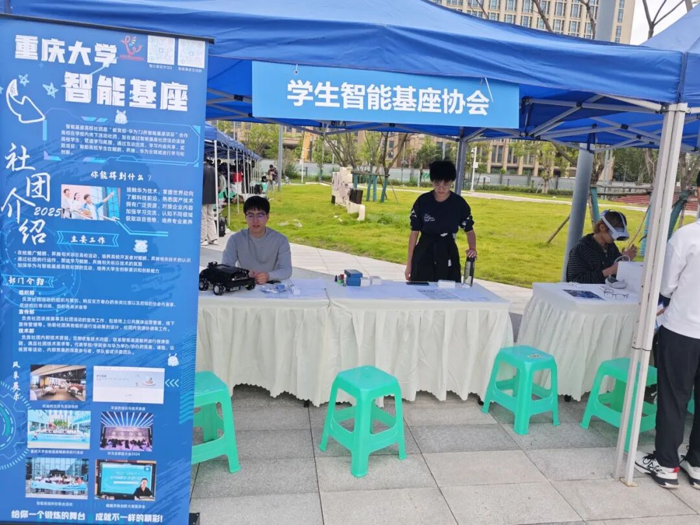

秋季纳新如火如荼的展开

秋季纳新反响热烈，又是一批新成员加入了重庆大学学生智能基座协会的大家庭。在此欢迎他们带着对技术的探索欲、对创新的渴望、对协作的认同参加社团，让社团的故事，翻开了新的一页！

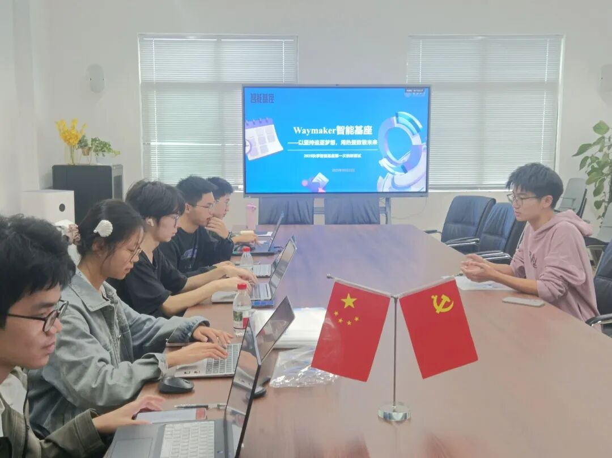

面试过程中，各部门协调运作，全面了解同学的专业能力，充分发挥每一个新同学的能力。

责任传承 · 交接仪式

会议开始前，主持人首先向大家介绍了

重庆大学智能基座协会指导老师陈咸彰老师，华为高校科研与人才发展部的仲崇彦老师，和来自重庆邮电大学智能基座社团的三名成员

随后，大会首项正式议程——社长交接仪式隆重开始。

上届社长曹泽阳学长将象征社团精神的信物传递给新任社长王亮

。随后，王亮社长为新任指导老师陈咸彰老师颁发聘书，凝聚师生共进之力。

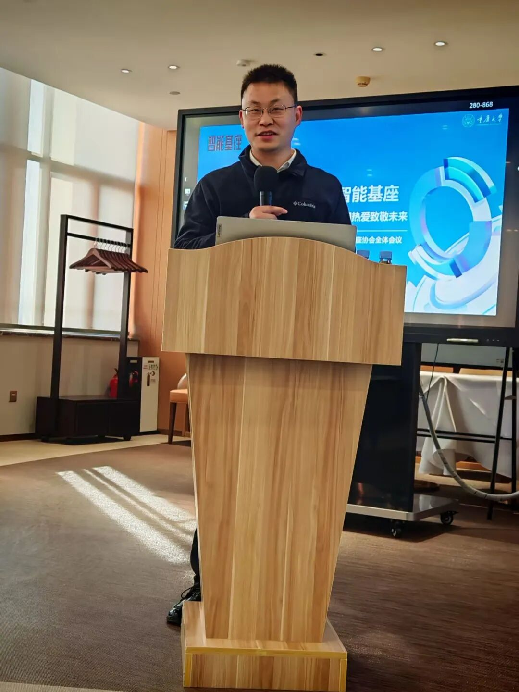

陈咸彰老师在台上发言

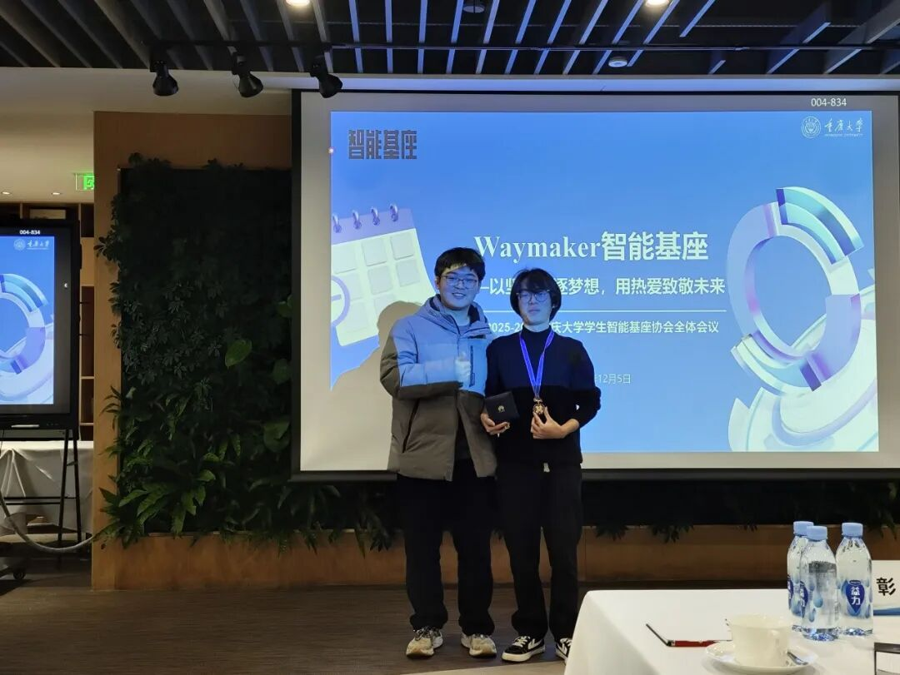

（左：上届社长曹泽阳

右：新任社长王亮）

新任社长为老师颁发聘书

右：陈咸彰老师）

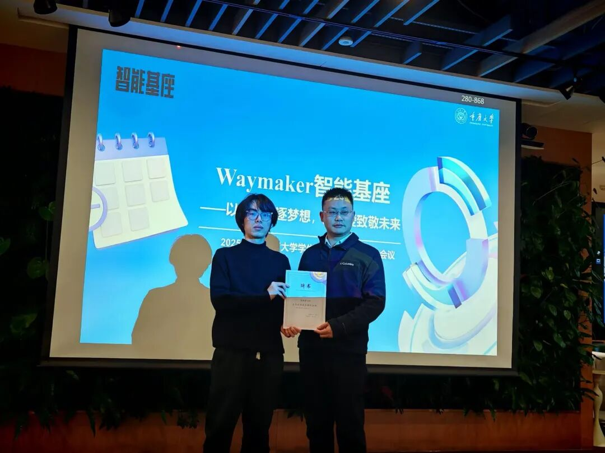

寄语未来 · 嘉宾发言

曹泽阳学长深情回顾了重庆大学学生智能基座协会的成长历程，并对新一届成员提出殷切期望。王亮社长随后登台，详细阐述了新学年的工作方向、目标规划及积分激励机制，为全体成员描绘出一幅清晰的发展蓝图。

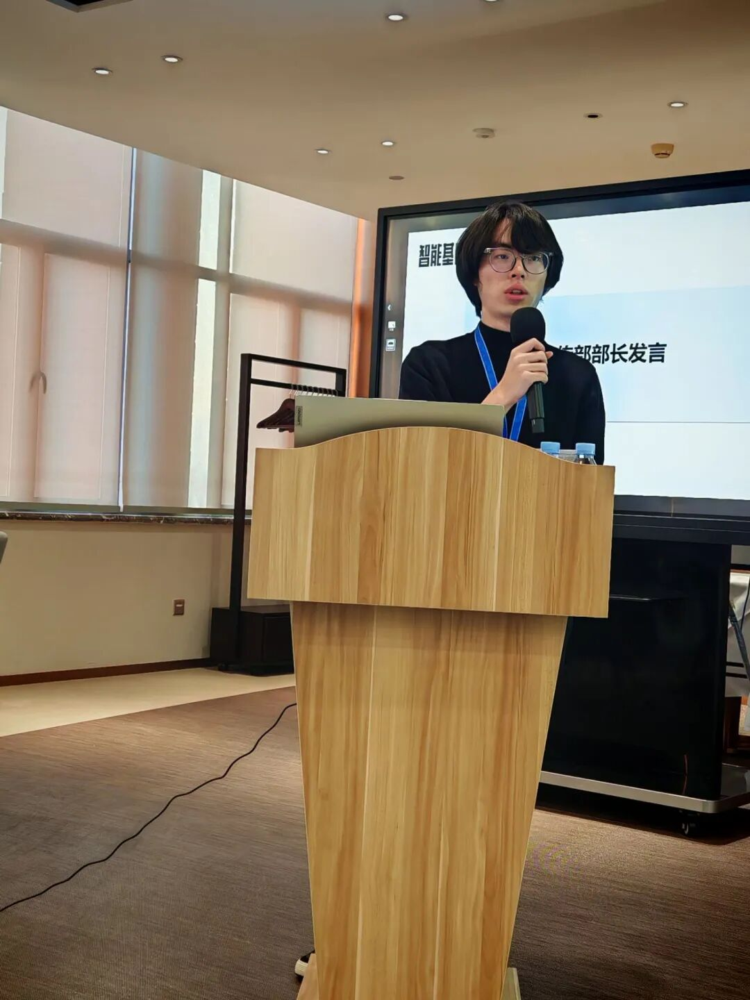

新任社长王亮发言

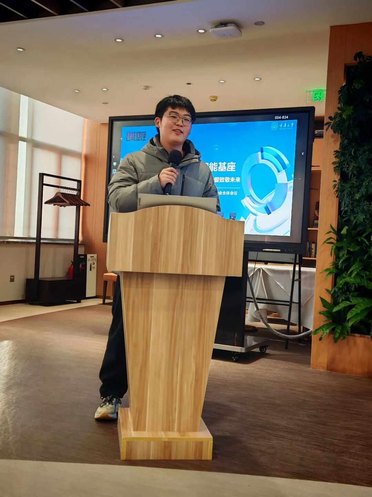

上届社长曹泽阳发言

部门亮相 · 共话发展

技术部部长吴怡、宣传部部长李冯云、黎晓、组织部部长黄兰婷，闫香杰几位部长依次上台，系统介绍了各部门的职能定位、年度计划与活动安排，并针对社团发展提出了切实可行的建议，充分展现了智能基座的活力与凝聚力。

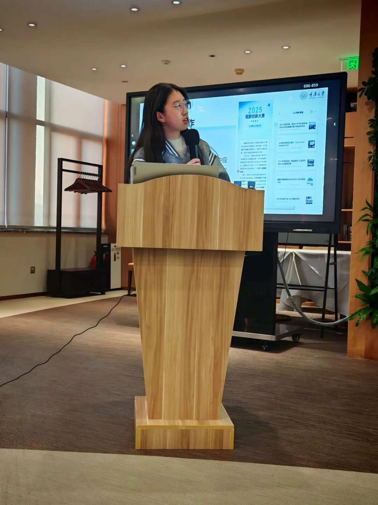

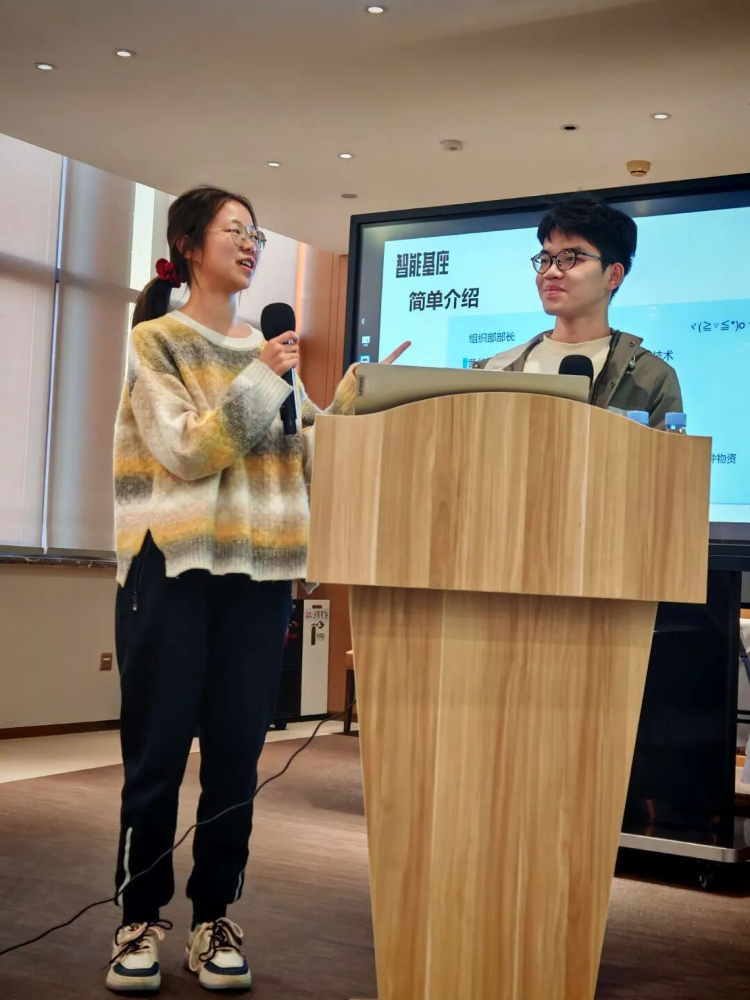

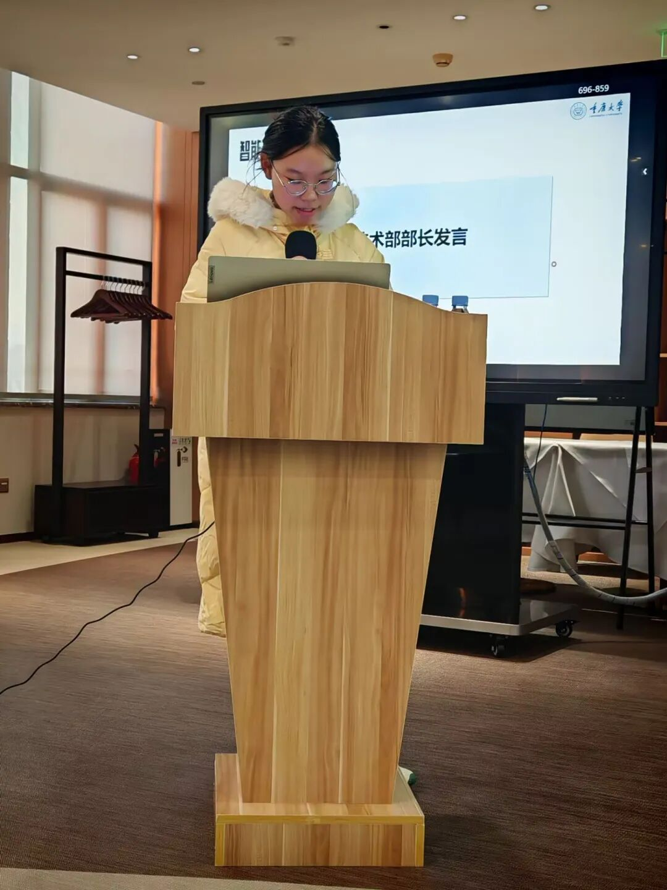

各部长轮流上台讲话

至此，第一次全体大会圆满结束。相信在未来，社团的核心成员们也能够携手并进，为社团发展而披荆斩棘，一往无前。

纳新落幕，是相遇的开始；大会结束，是行动的开始。

愿每一位成员在这里找到归属、施展才华、携手成长。

重庆大学学生智能基座协会，因每一个你而更加坚实、更加明亮！

未来已来，我们并肩前行。

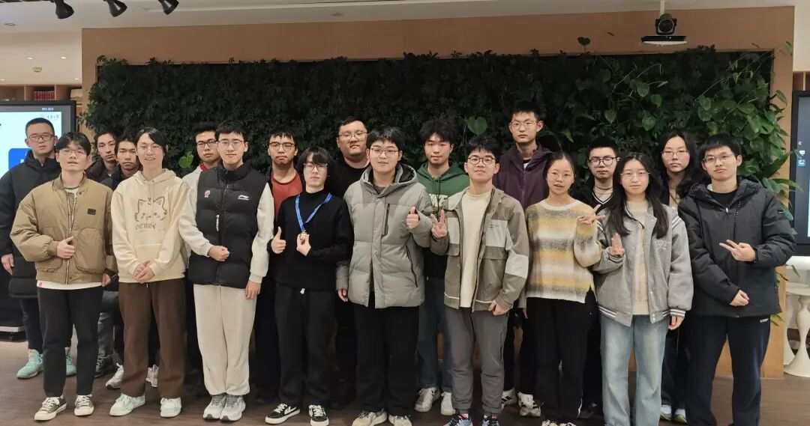

第一次全体大会所有与会人员合影

关注我们，获取更多活动信息与技术分享！

期待与你一起，书写下一个精彩故事！

## 原文链接

[点击查看微信公众号原文](https://mp.weixin.qq.com/s/Q6tI1LNnFPiEOj_7iXKKWw)

