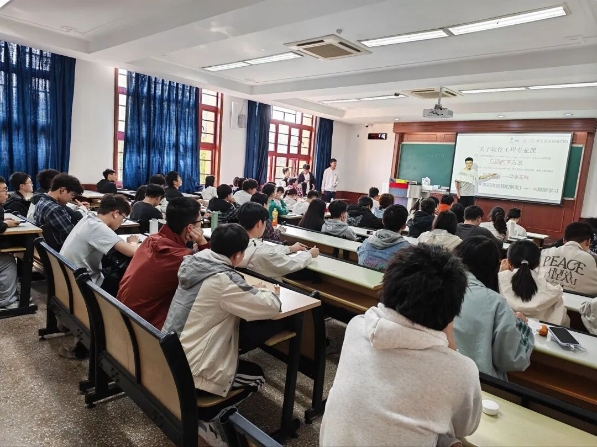
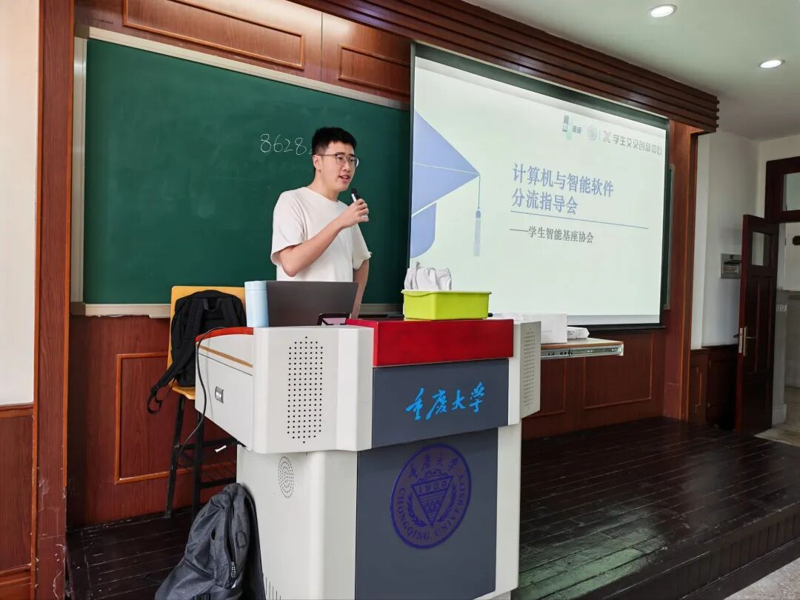
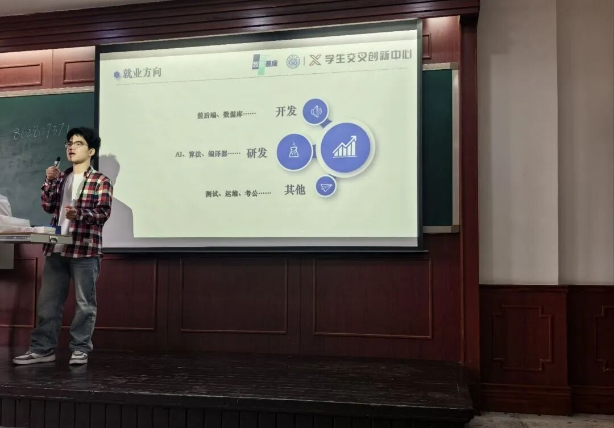
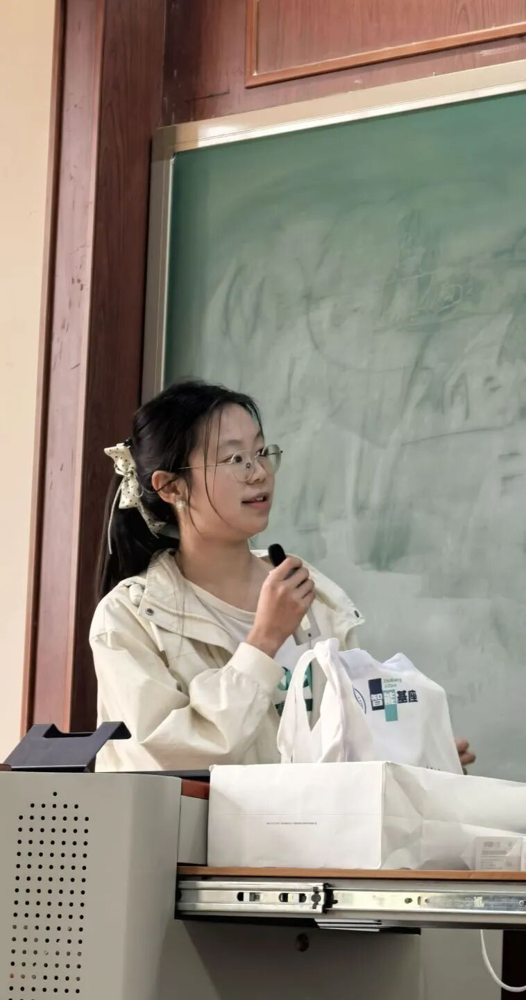
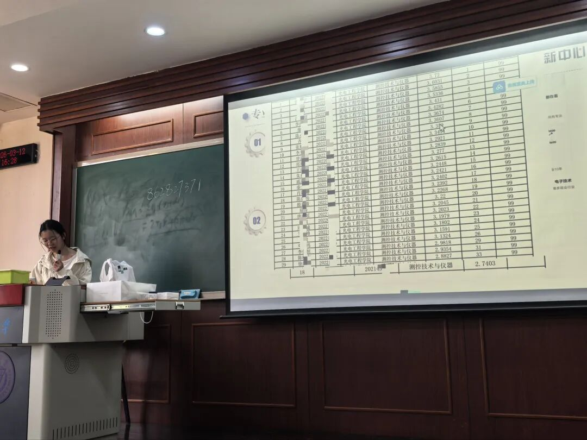
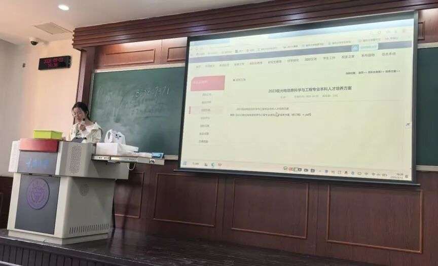
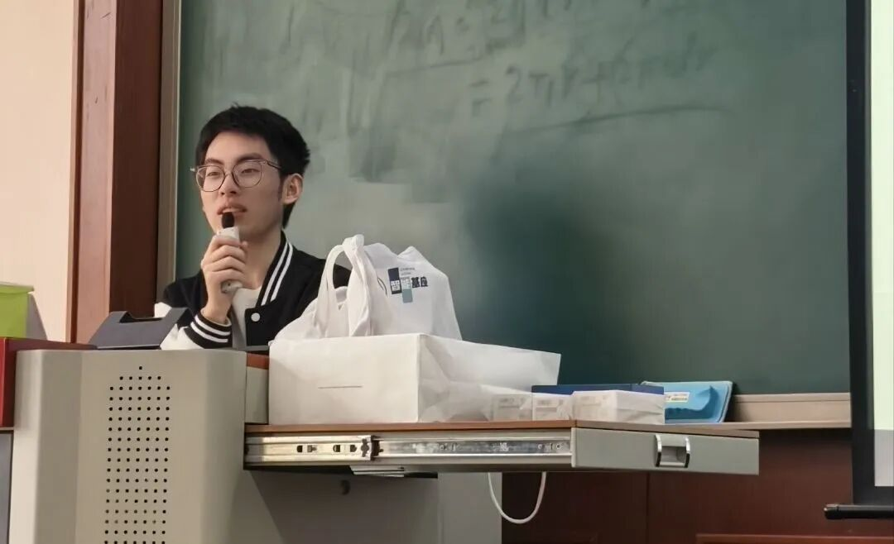

# CQU智能基座开展25届大类分流宣讲会

2026年3月12日15:30-17:30

## 活动内容

2026年3月12日15:30-17:30

，智能基座协会于

A区第五教学楼A5308教室

此次分享会参与同学众多，几乎座无虚席。

计算机与智能软件分流指导会

PART 1 ：蔡旭涛 -

蔡旭涛：学生智能基座协会技术部骨干，软件工程专业

指导会上，社团技术部骨干蔡旭涛学长从

课程难度、未来就业、自我规划

三个角度切入，通过幽默风趣的语言分别为同学们简要讲解了

类所含各专业的概念和其课程构成，以及相应的专业素养要求，为同学们专业选择提供可靠参考。

PART 2 ：闫香杰 - 计算机科学与技术

闫香杰：学生智能基座协会组织部部长，计算机科学与技术专业

随后是社团组织部部长闫香杰学长介绍

计算机科学与技术专业

。闫香杰学长同样围绕课程难度、未来就业、自我规划三个维度讲解，为各同学比较全面地说明了各专业毕业后就业方向，充分考虑到同学们的现实需求。

④浅析读研和本科就业

——第一轮抽奖环节——

奖品：U盘*2，马克笔*3

恭喜中奖的同学们！

未来信息分流指导会

黄兰婷 - 未来信息

学生智能基座协会光电工程专业

社团成员黄兰婷学姐针对

大类七个专业——自动化、电子信息工程、机器人工程、通信工程、测控技术与仪器、集成电路设计与集成系统、智能感知工程——的平均绩点和最低绩点进行分析，侧面体现各专业

保研率和平均毕业薪资

黄兰婷学姐放出各专业25年

对比图，从多方面为同学们分析各专业利弊。

专业详细信息查看处

学校官网各功能介绍

现场演示如何查找各专业培养计划、各导师背景资料联系方式等 ，为同学们参与科研竞赛提供渠道信息。

——第二轮抽奖环节——

学生智能基座社团宣传

王亮 - 社团宣传

学生智能基座协会社长，23计算机科学与技术专业

学生智能基座协会社长

宣讲会最后，王亮社长上台对分流宣讲会进行总结寄语：

机会是留给努力的人的

无论你选择哪条路

都需要你自己的努力

随后，社长开始介绍社团成立背景、成员优势，着重说明社团的当前规划（

科研项目组、QQ机器人、技术分享会

），展示社团的丰富资源和海量锻炼机会，邀请各位同学

Waymaker智能基座协会：智能基座高校社团是“教育部-华为72所智能基座项目”合作高校在学校内线下活动社团，旨在通过智能基座社团活动连接高校学生，营造学习氛围，通过互动交流、学习内容共享、实践项目，帮助高校学生在鲲鹏、昇腾、华为云领域进行学习和创新。

——第三轮抽奖环节——

本次宣讲会有效帮助各位同学多方位了解所在大类各专业具体情况，为最终的分流选择提供多角度依据，减少因信息差带来的选择失误；同时为同学们介绍了各专业分流后的不同情形，提前为同学们规划未来安排作出初步建议，为后续制定学业规划提供有利指导。

微信公众号丨CQU智能基座

## 原文链接

[点击查看微信公众号原文](https://mp.weixin.qq.com/s/bqAooU7opecAZVJwj0YZug)

