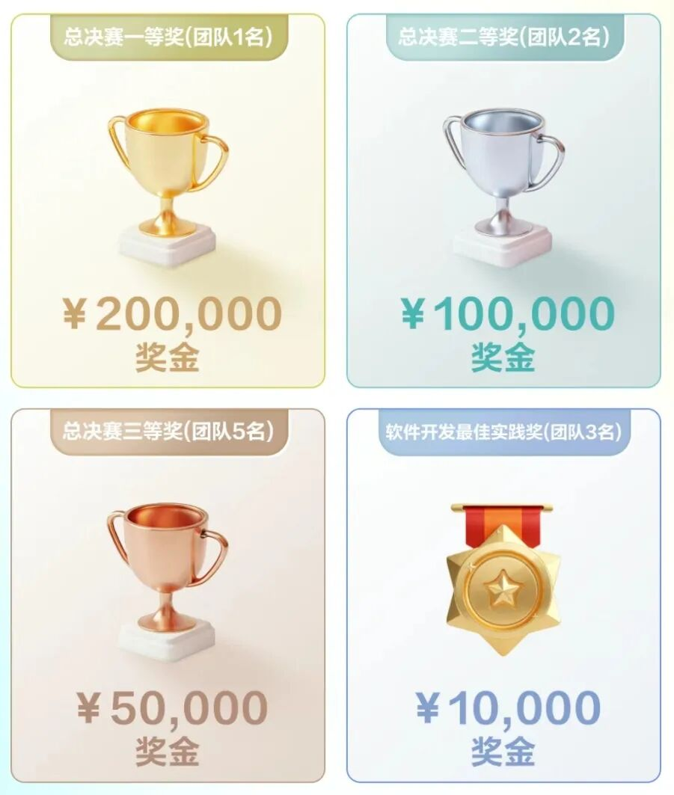
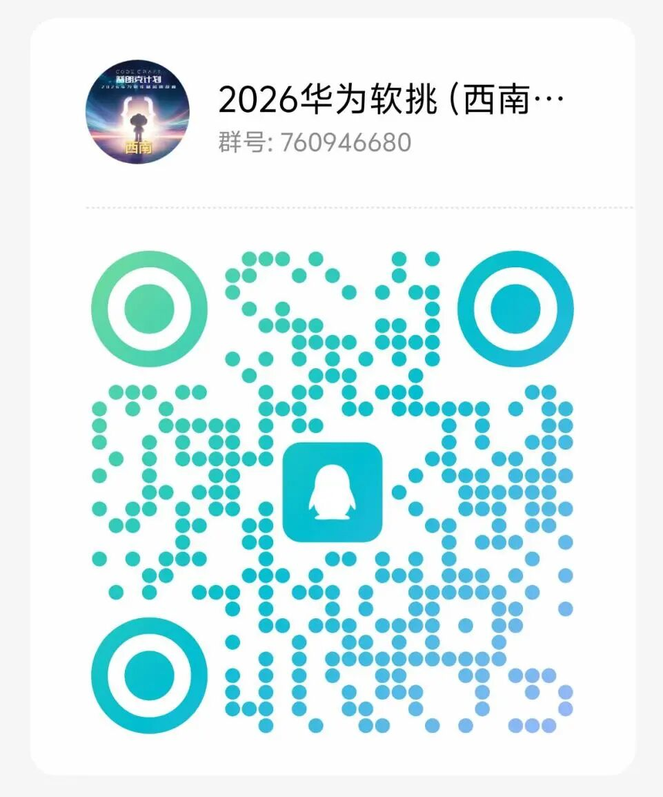
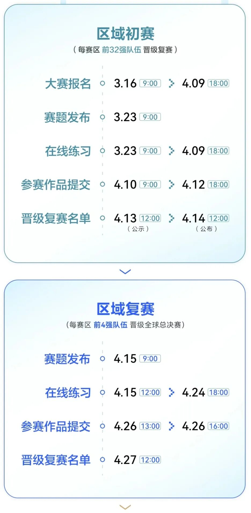
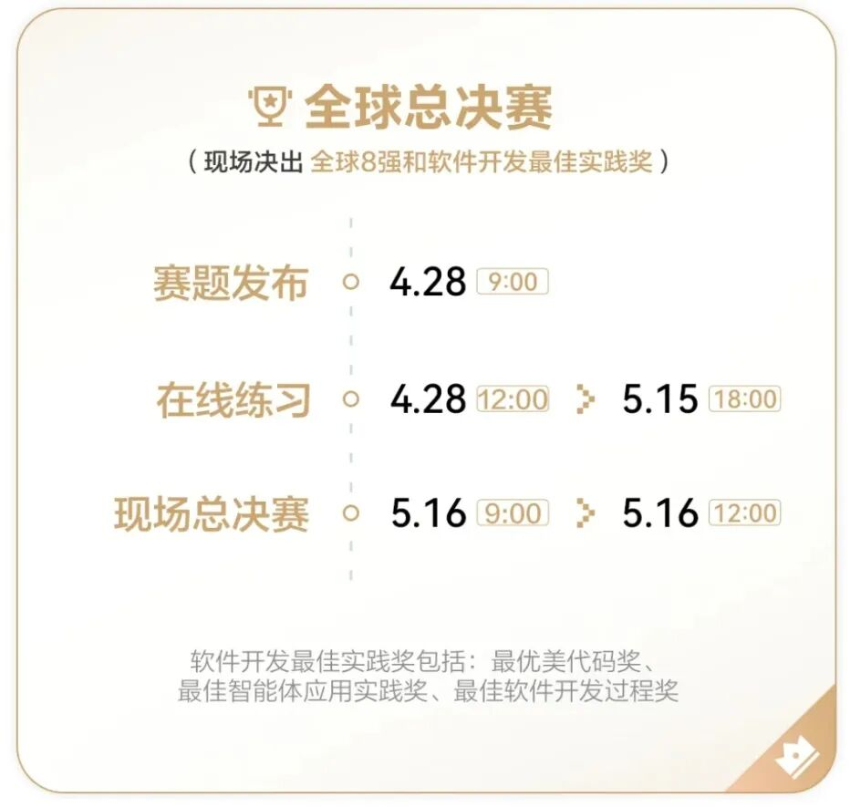
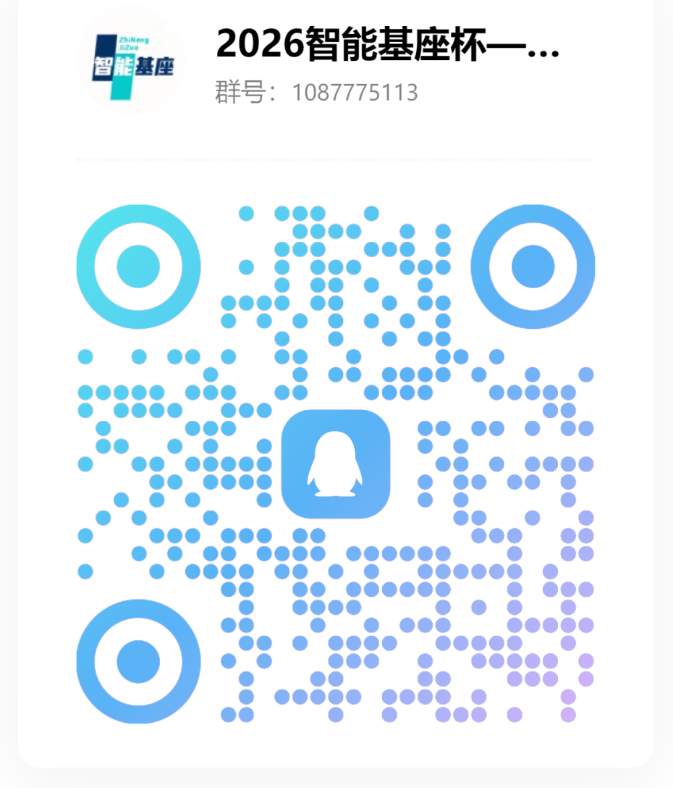

## 活动内容

* 机考绿卡：竞赛人才 quick pass 通道，可免机考。

* 面试绿卡：竞赛人才 quick pass 通道，可免一轮专业面试；

总决赛一等奖团队可免两轮专业面试。(详情请见大赛官方微信)

* 外卡名额：大赛增加外卡规则，详情请见 “赛区详情 - 晋级 & 奖项” 页面。

Global Final

截图来自华为软件精英挑战赛官网

小白也可以玩转软挑

赛题聚焦系统优化，技术门槛友好

完成即有机会获奖，保底证书get！

校内赛群福利多多，助你一路通关！

群内快速组队，找到你的天命队友

干货攻略+经验分享，助你轻松突破

证书好拿，组队自由，冲就完事！

西南地区官群二维码

群内提供赛程关键节点

赛题组专家也会为大家答疑解惑

华为软挑（西南赛区）官方赛事QQ群

2026年3月23日至4月12日

（与软挑初赛同步）

2025年4月9日

Contest Schedule

* 说明：比赛时间周期可能存在延期及变化，

请您及时留意刷新页面信息。

Registration Guide

1.扫描下方官网报名二维码报名，选择“西南赛区”，学校填重庆大学，组队参与华为软件精英挑战赛；

2.加入【校内赛】群扫描下方二维码；

3.填表确认：队长填写报名表

登记校内赛报名；

4.想组队的同学可以点击组队墙

华为软挑官方报名二维码

华为软挑（校内赛）交流QQ群

微信公众号 | CQU智能基座

<<< END >>>

图片丨华为西南地区招聘

## 原文链接

[点击查看微信公众号原文](https://mp.weixin.qq.com/s/LIEJHJZwCZAaEy4q2tm27A)

