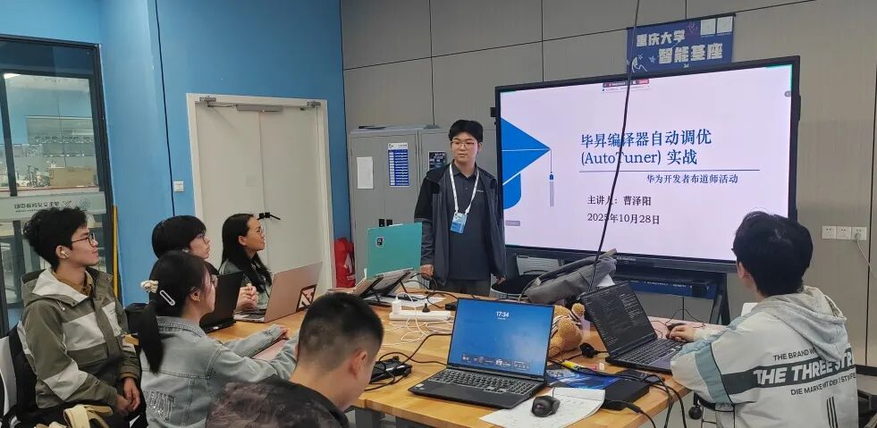
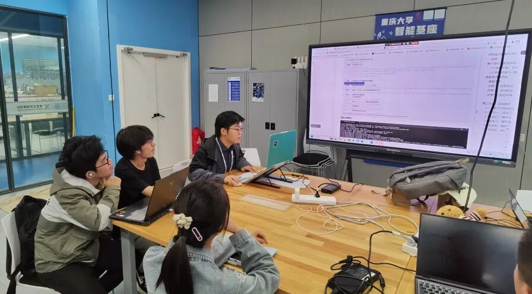
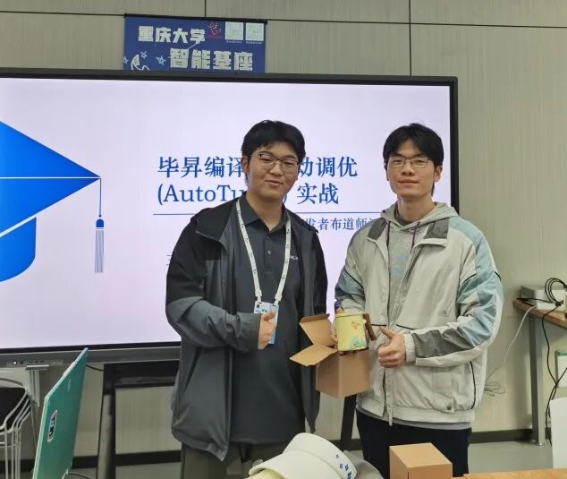
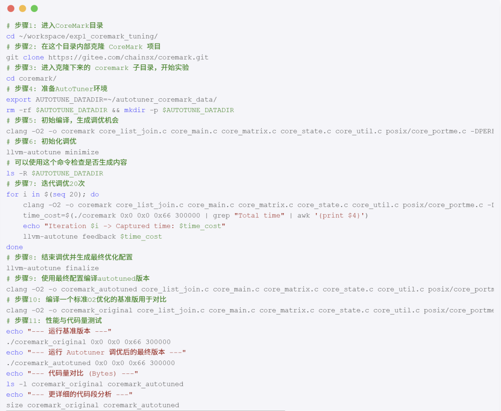
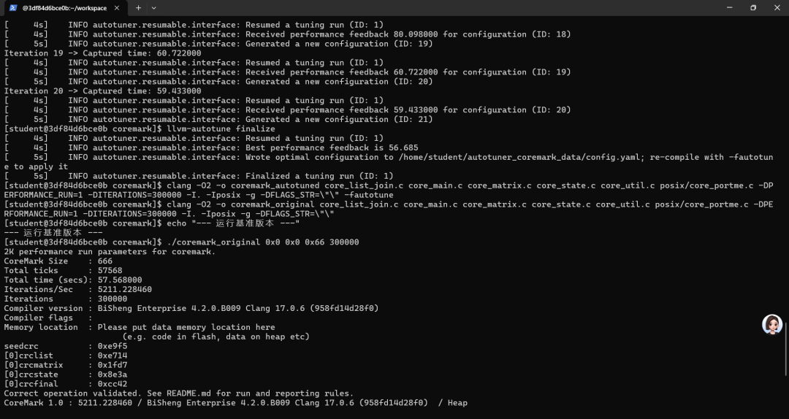
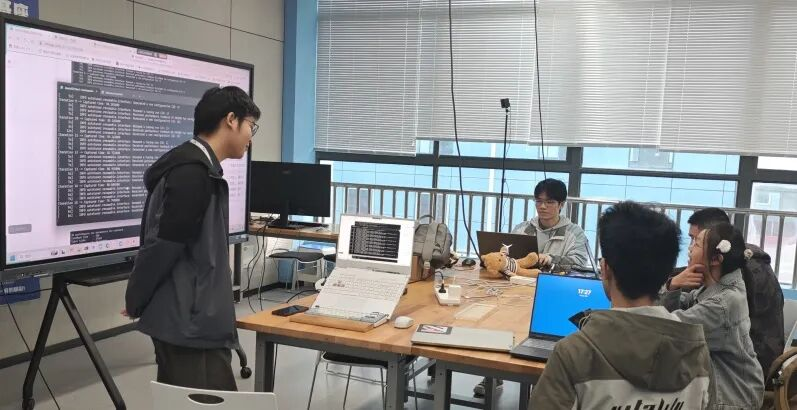

# 毕昇编译器自动调优（AutoTuner）实战成功召开

毕昇编译器自动调优（AutoTuner）

## 活动内容

毕昇编译器自动调优（AutoTuner）

重庆大学学生智能基座协会于10月28日在科学城校区学生交叉创新中心DX210实验室召开了

毕昇编译器自动调优（AutoTuner）实战讲座

，通过理论讲解与动手实践相结合的方式，让参与者亲身体验了毕昇编译器在代码调优中的应用。

本次活动由计算机学院2022级计卓01班、华为布道师

同学担任主讲，并特邀计算机学院

老师现场指导，采用线上线下相结合的方式，为同学们带来了一场深入的技术实践体验。

一、聚焦前沿技术,破解学习难题

本次活动聚焦计算机科学与技术专业核心课程《编译原理》中的实践难点。曹泽阳在开场介绍中指出，编译器高级优化对于提升程序性能至关重要，但在传统的aarch64+openEuler+毕昇编译器实验环境中，复杂的环境配置往往成为初学者难以逾越的障碍，消耗了大量本应用于核心概念学习的时间与精力。

为此，本次活动提出了清晰的解决方案：

利用Docker容器技术封装完美的实验环境，实现“开箱即用”

，使参与者能绕过繁琐配置，直接聚焦于编译器优化的核心原理与实践。活动目标在于引导同学们从理解手动优化，进阶到体验AI驱动的自动调优，感受毕昇编译器AutoTuner如何智能地寻找最优编译选项，从而在标准优化基础上实现性能的再飞跃。

曹泽阳进一步阐述了选择Docker作为实验载体的四大优势：

跨平台一致性、环境隔离性、绝对可复现性以及资源轻量化

，确保了所有参与者能在统一、纯净的环境中顺畅实验。

二、实战引领,体验AI自动调优魅力

随后进入实战环节，曹泽阳引导参与者访问其布道者个人技术博客，并带领大家逐步完成了首个核心实验——使用CoreMark进行综合性能调优，完整展示了从

环境准备、代码获取、AutoTuner初始化、多轮迭代调优，到最终性能对比分析

经过AutoTuner自动调优后的CoreMark程序，运行时间较标准O2优化版本缩短了约1.07%，CoreMark分数相应提升，同时可执行文件总体积减少了近30%，生动印证了AI自动调优在提升性能与优化代码体积方面的双重效力。这一直观的对比结果，极大地激发了同学们对编译器优化技术的兴趣。

线下参与的同学在初步掌握方法后，自主完成了包括

循环融合、强度削减、循环分块、矩阵向量化

在内的其余四项进阶实验。活动现场学习氛围浓厚，同学们在动手实践中深化了对编译优化技术的理解。活动还根据实验完成速度，

为线下参与者设置了奖品

，增添了讲座的趣味度与互动性。

三、技术交流,培育创新实践能力

本次毕昇编译器AutoTuner实战活动的成功举办，有效降低了同学们接触高端编译优化技术的门槛，提升了解决复杂工程问题的能力，为计算机人才培养注入了新的活力，也为后续系列技术分享活动奠定了良好的基础，生动展现了优秀学子在技术布道与知识传播中的核心作用。

重庆大学学生智能基座协会负责人表示，未来将继续依托学生智能基座协会，开展更多高质量的技术交流活动，推动前沿技术进校园，为

培养适应时代需求的创新型计算机人才持续贡献力量

## 原文链接

[点击查看微信公众号原文](https://mp.weixin.qq.com/s/v9A10hWHdAfULw6EVZqC-w)

