# 双队闪耀西南！重庆大学学生智能基座协会斩获鲲鹏创新大赛金铜双奖

鲲鹏创新大赛2025是面向基础软/硬件开发者的顶级赛事，旨在鼓励广大开发者基于鲲鹏全栈根技术，围绕产业真实难题，共同打造基础软硬件解决方案。

## 活动内容

鲲鹏创新大赛2025是面向基础软/硬件开发者的顶级赛事，旨在鼓励广大开发者基于鲲鹏全栈根技术，围绕产业真实难题，共同打造基础软硬件解决方案。

10月24日，鲲鹏应用创新大赛2025西南赛区总决赛圆满结束，本次西南赛区鲲鹏创新大赛共吸引300余名开发者报名，参赛队伍60余支。CQU智能基座社团有四支队伍参与其中，入围数为

其中，重庆大学学生智能基座协会的

“CQU-WayMaker-AI守护星队”

凭借硬核技术实力与创新实践成果脱颖而出——CQU-WayMaker-AI守护星队摘得

，智农护莓队荣获

，用青春智慧为协会科创名片再添璀璨一笔！

FUTURE TECHNOLOGY

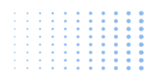

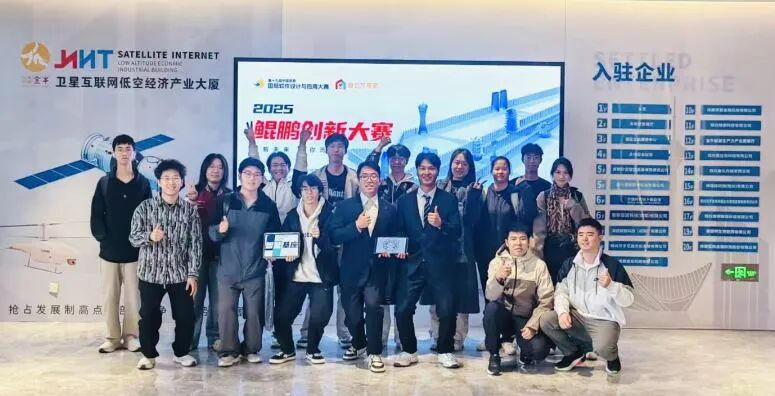

在比赛中，重庆大学学生智能基座协会代表队

以智慧为矛、技术为盾，披荆斩棘闯赛道，分别斩获

揽获八千元，三千元奖金。

荣耀的背后，是无数个在实验室里深耕细作的日夜。自参赛筹备以来，两支队伍便锚定

“技术创新+场景落地”

双核心，开启了高强度的备战模式。

AI守护星队聚焦

实际需求，将技术与应用场景深度融合，从算法设计到系统优化，每一个参数都经过精密调试；智农护莓队则扎根

领域，构建计算机视觉模型，将人工智能和农业生产深度结合。团队成员们分工协作，白天钻研技术文档、优化方案细节，夜晚围绕实验数据展开讨论，在一次次试错与迭代中打磨项目，用坚持与专注奠定了荣耀时刻。

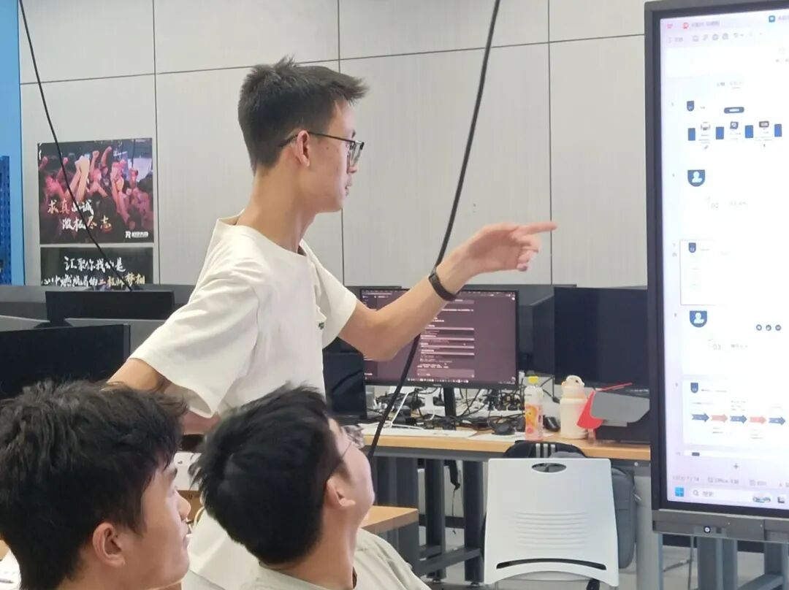

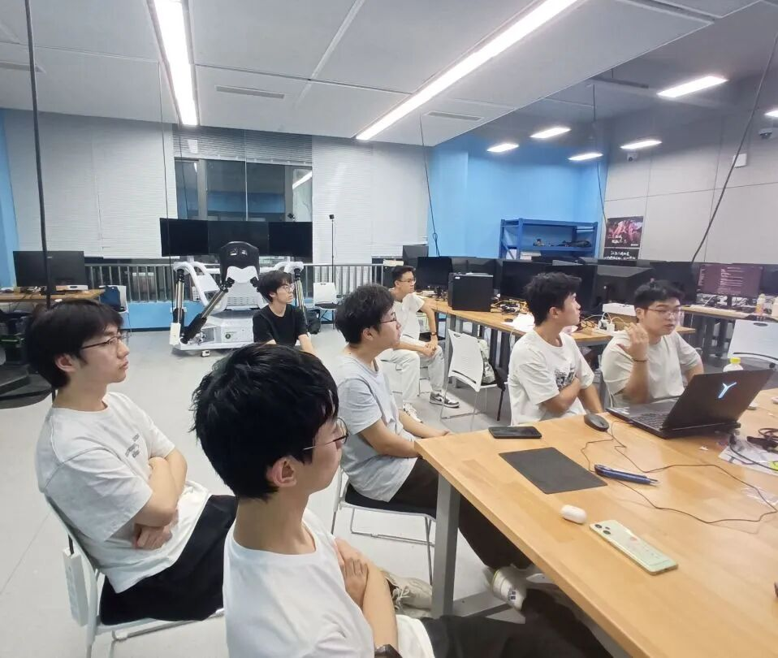

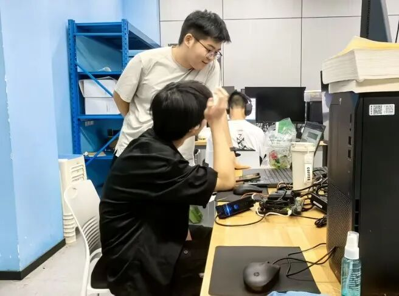

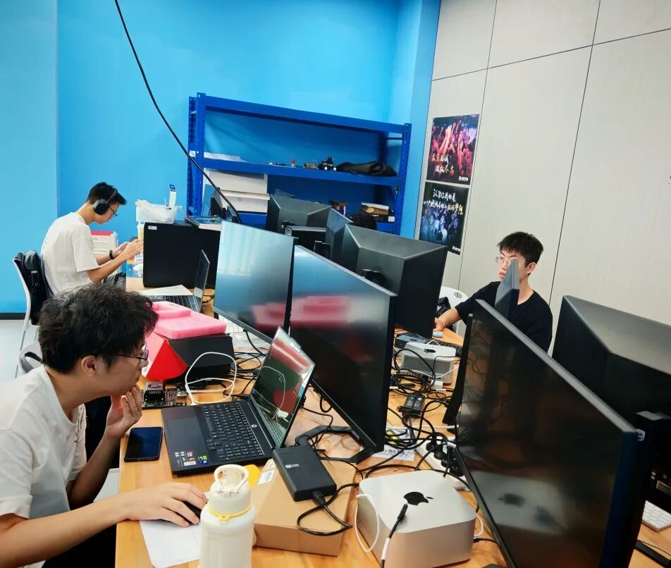

—团队成员扎根实验室备赛—

此次比赛，团队成员们为之做了良久准备。他们围坐协作，指尖在键盘敲击代码，电脑屏幕上运算结果实时迭代。反复推演场景适配方案，优化算法模型、调试数据接口，队员们共同研讨着算力调度与落地效能。每一次微调都凝聚巧思，每一轮测试都筑牢基础，科技赋能的蓝图在他们不懈的求索中愈发清晰，静待大赛绽放锋芒。

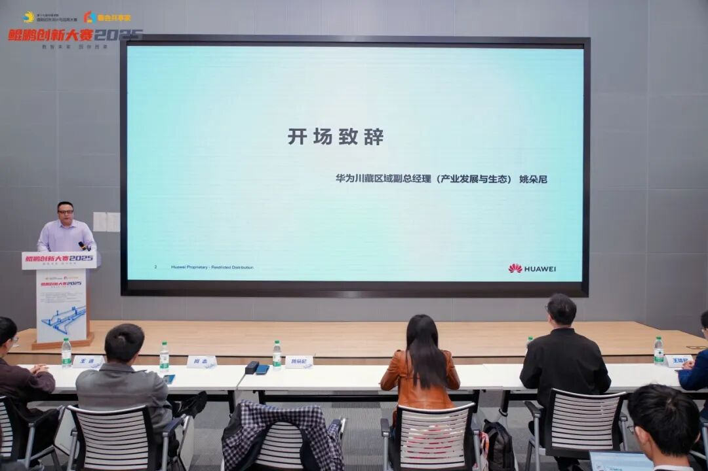

—鲲鹏创新大赛2025现场照—

比赛来临，现场高手云集，竞争异常激烈。在关键的项目路演环节，两支队伍依次登台，用精彩的PPT展示与沉稳的答辩，赢得了评委的高度认可。

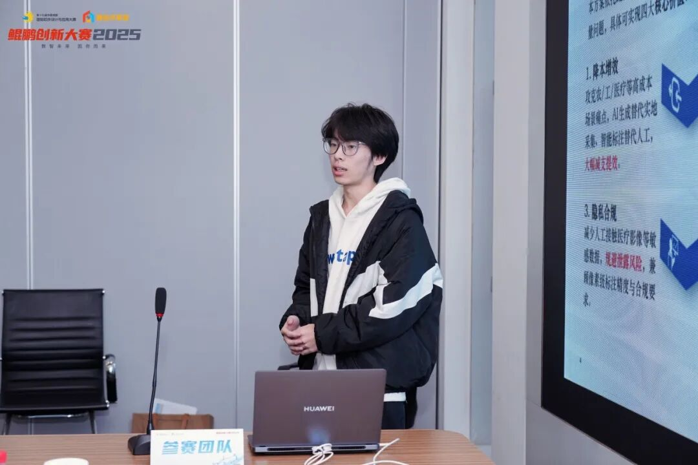

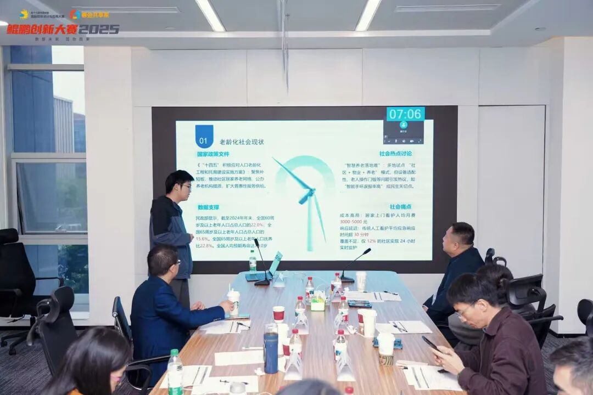

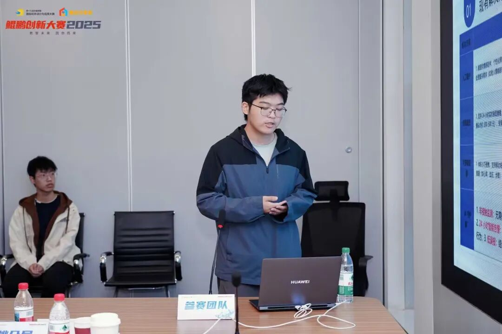

CQU-WayMaker-AI守护星队的成员以清晰的逻辑脉络展开项目介绍：从老龄化社会的项目背景、技术架构到核心优势，再到实际应用效果，每一页演示文稿都凝聚着团队的心血。团队成员结合生动案例将复杂的技术原理通俗化呈现，面对评委关于技术的提问，团队成员沉着应答，逻辑清晰、论据扎实，充分展现了扎实的专业功底。

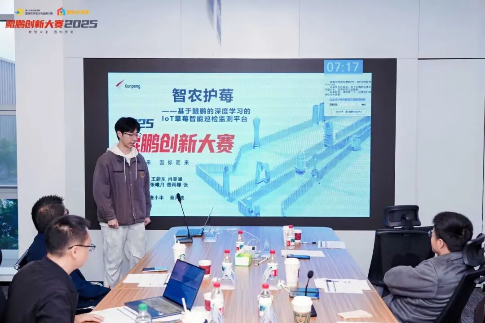

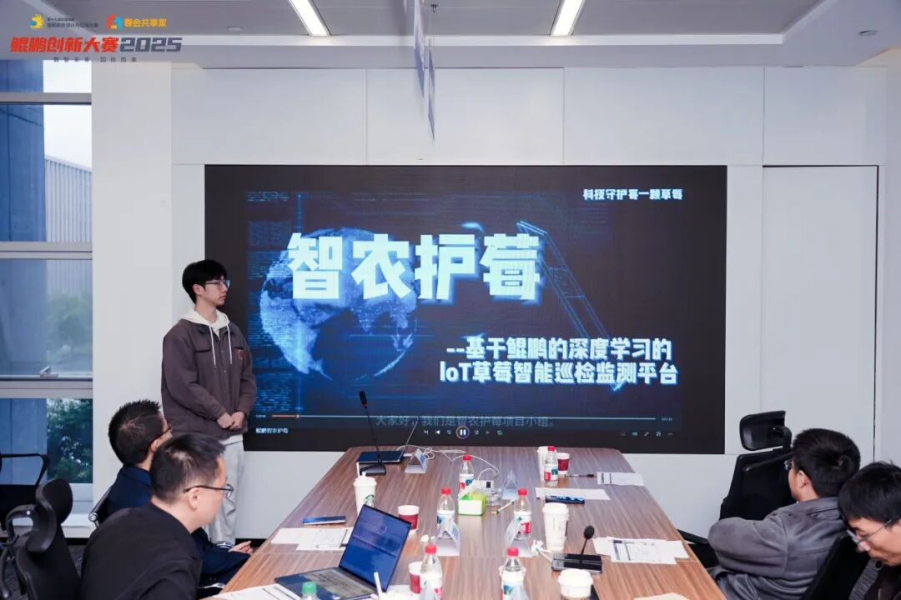

智农护莓队以“科技赋能农业”为核心展开汇报，PPT中的数据、直观的效果图，让评委直观感受到项目的实用价值。成员们围绕模型优化、场景适配等关键内容详细阐述，面对评委提出的风险应对、推广模式等问题，坦诚分享思路与规划，展现了参赛者的专业与务实。

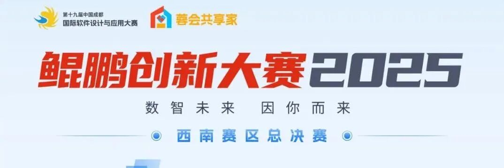

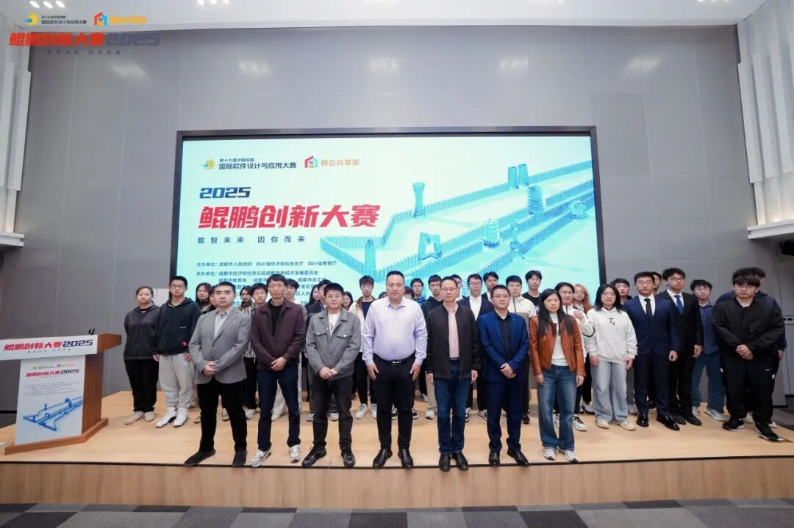

鲲鹏创新大赛2025

经过多轮激烈角逐，评委团从技术创新性、应用完整性、可落地性等维度进行综合评审，最终

CQU-WayMaker-AI守护星队

凭借突出的项目质量与出色的现场表现，分别斩获

此次获奖，既是对两支队伍技术实力与创新能力的肯定，也是重庆大学学生智能基座协会产学研融合的生动实践。

为每一份坚守喝彩，为每一次突破点赞！

未来，协会将继续搭建优质科创平台，鼓励更多重大学子立足鲲鹏生态，在科技创新的赛道上勇攀高峰，用技术力量解决实际问题，书写更多属于青年一代的科创华章。

让我们共同期待，重庆大学学生智能基座协会科创力量再创佳绩！

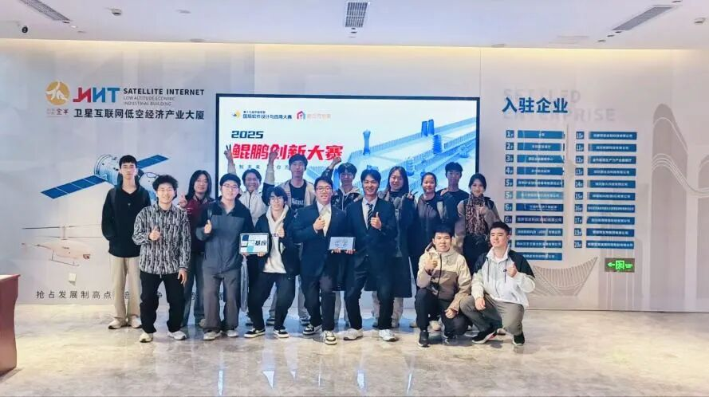

微信公众号丨CQU智能基座

图片丨鲲鹏创新大赛2025 学生智能基座协会

## 原文链接

[点击查看微信公众号原文](https://mp.weixin.qq.com/s/B_oIGGKt5DEkFyOrdDravQ)

